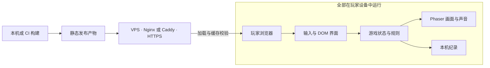

# Hatch Garden · 架构与玩法设计

日期：2026-09-10。状态：第一版已按本设计实现并完成本地浏览器验证；VPS 部署仍未开始。

建议做一个打开即可玩的单人下蛋小游戏：所有游戏逻辑、动画、声音、纪录都在浏览器里运行，VPS 只托管构建后的静态文件。在线玩家增加时，服务器主要承担首次下载、缓存校验与连接开销，不承担每帧计算。

## 1. 玩法范围

Hatch Garden 是一个独立制作的点击孵化小游戏：采用重新绘制的母鸡、小鸡和场景，以点击下蛋、暂停等待和孵化成长为核心循环。它不使用任何第三方游戏的角色、美术、音频或代码，也不隶属于任何既有作品。

### 第一版核心循环

1. 进入页面后显示母鸡和一句操作提示，首次点击或按空格即进入游玩并尝试解锁声音。
2. 母鸡在场地内慢慢走动。点击场地或按空格，都触发同一个下蛋动作；不需要瞄准。
3. 每次下蛋动作先以出生顺序遍历全部可下蛋成年母鸡，为它们逐一预留不冲突的空位；再在同一规则帧创建所有已规划的蛋。若只剩 2 个空位，即使有更多母鸡请求下蛋，也只有前 2 只成功预留并下蹲；本局分数按实际新蛋数增加。没有空位的母鸡不播放下蛋动作。
4. 每颗蛋按自己的游戏内年龄孵化：完整蛋 → 裂纹 → 破壳 → 小鸡。第一次裂纹在 2.70 秒，第二次裂纹在 4.02 秒，5.46 秒破壳。蛋优先出现在各自母鸡脚边；附近已有蛋时改用最近合规空位。蛋位采用随当前画布宽高和视觉缩放即时生成的六角网格，没有固定总数量或固定屏幕坐标。最后一个可用蛋位被填满时触发星光和 3 秒的游戏成功庆祝音效；满蛋后直到有蛋孵化，新的输入不再生成蛋。
5. 小鸡可以相互重叠地自由走动，约 8 秒后成长为成年母鸡；不再作为腾出空间而直接离场的对象。玩家连续 8 秒没有下蛋操作时，当前仍在场地内活动的母鸡有一半（向下取整）会朝随机画布边缘走出；之后每多 16 秒再执行一轮。若活动成年鸡数达到当前画布一键可大致铺满的蛋位数，也会立即离开一半；这条拥挤规则有独立的 10 秒冷却。任何下蛋操作都会从该操作时刻重新开始计算空闲时间，哪怕该次操作因满蛋或冷却没有生成蛋。鸡跨过画布外一只成年鸡宽度的逻辑边界才移除。已有成绩一直保留到本局重新开始。
6. 当成年鸡已全数离场时，不论场上是否还有幼鸡，点击场地或空格仍可产蛋。蛋先尝试落在屏幕中心；中心附近已有蛋时，选择距离中心最近且满足蛋间距的空位。
6. 无倒计时、无失败。暂停菜单提供继续、声音设置、重新开始；重新开始本局不清空最高纪录。

第 4 条是本版的建议变化：按单颗蛋计时能避免长时间连续点击积压大量蛋。动画时长、移动速度、出生密度均为待试玩调整的设计值，不当作原作精确规则。

### 首版功能边界

| 首版包含 | 后续按需要增加 |
| --- | --- |
| 自由下蛋、孵化、散步 | 60 秒挑战、颜色分类、迷宫 |
| 鼠标、触屏、空格 | 无障碍专项玩法模式 |
| 横屏与竖屏布局 | 可安装 PWA、离线启动 |
| 本机最高纪录、声音设置 | 账号、云存档、跨设备同步 |
| 少量奖励动画 | 皮肤与收藏 |

自由游玩下的纪录表示本机本局累计下蛋数量，属于趣味统计，不是有统一时长条件的竞技成绩。

## 2. 技术选型

| 部分 | 推荐 | 选择原因 |
| --- | --- | --- |
| 开发与构建 | Vite + TypeScript | 本机或 CI 构建，产物为静态文件 |
| 游戏显示与输入 | Phaser | 复用纹理、动画、缩放和输入能力，避免维护这些通用机制 |
| 游戏规则 | 独立 TypeScript 模块 | 不依赖 Phaser、DOM、网络，便于测试规则和长时间运行 |
| 界面 | HTML + CSS | 中文文本、按钮、焦点与手机布局易于处理 |
| 美术源文件 | SVG | 适合本作少色块、清楚轮廓的画风，容易改色与缩放 |
| 运行时美术 | 加载时栅格化并缓存为纹理 | 每只小鸡引用共享纹理，避免重复解析 SVG |
| 存档 | localStorage | 只保存几个很小的设置与纪录字段 |
| 部署 | 现有 Nginx 或 Caddy | HTTPS 静态文件服务，沿用 VPS 现有入口 |

Phaser 是前端引擎，不意味着服务器需要运行 Node.js。Vite 的正式构建产物默认在 `dist/`；开发服务器和预览服务器不作为生产服务。[Vite 官方部署说明](https://vite.dev/guide/static-deploy.html)

原生 Canvas 2D 也能实现本作，下载体积可能更小，但需要自行处理资源、动画、输入和生命周期。这版优先选择 Phaser 来降低实现与维护成本；实现后测量压缩包体积，再决定是否需要更轻的方案。React、SSR、Next.js、物理引擎、ECS 和 Worker 都没有首版需求。实现时选择经验证的 Phaser/Vite 版本并锁定依赖，不在设计阶段假定某个“最新版本”。

## 3. 部署与运行拓扑

首版应用层后端为零：没有数据库、WebSocket、登录服务或逐次点击请求。资源全部就绪后，本局游戏不再需要网络请求，当前已加载页面断网仍可继续玩；断网刷新或关闭后再打开不作保证，离线启动属于后续 PWA 能力。

### VPS 需要做的事

- 服务 HTML、带内容哈希的 JS/CSS/美术/音频文件，正确设置 MIME 类型。
- HTML 使用 `Cache-Control: no-cache`，允许缓存但每次使用前校验版本；Vite 生成的带内容哈希 JS/CSS 使用一年缓存与 `immutable`。
- 当前 SVG 和音频以稳定资源键和固定 URL 由 Phaser/HTML 加载，因此 `/audio/`、`/characters/`、`/eggs/`、`/environment/`、`/fx/` 与 `/ui/` 必须每次校验版本，不能误设为永久缓存；未来改为构建期图集后再使用资源哈希和长缓存。
- 启用已有的 gzip；有 Brotli 支持时可以采用构建阶段预压缩。压缩能力按现有服务器确认，不强制新增模块。
- 构建产物按发布版本保存，上传完整后原子切换发布入口。保留旧版本资源的可访问地址一段时间，避免旧页面或已缓存 HTML 请求旧哈希时 404；验证后清理旧版本。
- 需要回滚时切回上一发布版本。404 的资源返回 404，不能一概返回 HTML。
- 首版只有一个页面，不引入前端路径路由。部署到子目录时在构建阶段设定正确资源 base，验证首页及所有资源地址。

这些是待部署时执行的配置要求，本轮未修改任何 VPS。[Nginx 响应头模块文档](https://nginx.org/en/docs/http/ngx_http_headers_module.html)

### 成本模型

服务器消耗与新访问下载量密切相关，不随每次下蛋增长。假设首访下载 1 MB、每天 1 万次冷访问，则资源流量约为 10 GB/天，尚未计算协议开销、缓存命中与重复加载。这个算例不是当前包大小或 VPS 承载能力测试。

因此先控制首包和缓存，再根据实际出口带宽、访问来源与峰值决定是否增加 CDN。并发首次下载仍会占用带宽、TLS 和静态服务资源，不能称为“无限并发”或“零服务器压力”。

## 4. 浏览器内的职责边界

只保留足够清楚的几个模块，不先搭建通用游戏平台。

| 模块 | 拥有的状态与职责 | 边界 |
| --- | --- | --- |
| app | 加载、进入游戏、暂停原因、销毁、布局 | 统一协调，避免各模块单独开主循环 |
| input | 鼠标/触屏/键盘到动作的映射 | 不直接加分或创建实体 |
| game | 母鸡、蛋、小鸡、游戏时钟、分数、随机种子 | 唯一规则来源，无 Phaser/DOM/存储 API |
| presentation | Phaser 对象、纹理、姿态、粒子、显示插值 | 映射实体 ID 到显示对象，不改变分数或孵化规则 |
| ui | 分数文本、声音/暂停图标、暂停菜单 | 通过状态快照读数据，通过动作请求改变游戏 |
| audio | 首次交互解锁、音量、音效并发、暂停 | 消费游戏事件，不能反过来推进规则 |
| storage | 设置、最高纪录、版本校验和读写失败处理 | 保存小型普通数据，不保存 Phaser 对象 |
| assets | 稳定资源键与文件、尺寸、锚点、加载组 | 文件改名不影响游戏规则 |

当前实现采用 `src/game`、`src/phaser`、`src/ui`、`src/game/platform` 和 `art`。没有拆分工作区、多包仓库或共享服务器包。

### 数据与事件流

物理输入 → 标准动作 → game 更新 → 事件与状态快照 → 画面、声音、UI、存档。

建议动作：`LAY_EGG`、`PAUSE`、`RESUME`、`RESTART_SESSION`、`SET_SOUND`。

建议事件：`EggLaid`、`EggFieldFilled`、`EggHatched`、`ChickMatured`、`AdultExiting`、`AdultLeft`、`BestChanged`。每个规则事件只发一次，声音和动画消费后即清理；不保存无限事件历史。`EggLaid` 是下蛋计数增加的唯一入口，`EggHatched` 不重复增加这个分数。

成年母鸡状态：散步 ↔ 下蛋短暂停顿 → 走向边缘并离开。蛋实体状态：完整 → 裂纹 → 孵化完成并移除，同时产生一个小鸡实体。小鸡状态：出生 → 散步 → 成长为成年母鸡。蛋仅在生成阶段做间距检查，小鸡与其他角色不做避碰。每次散步从当前位置抽取随机方向和距离，并持续走到目标；成年鸡和小鸡都会有长距离外游目标，因此都有机会走出外圈。蛋的落位范围是可见场地；鸡的活动和回收范围在画布四周额外延伸约一只成年鸡宽度，只有跨过外圈才从状态和画面中移除。

破壳时刻由游戏时钟决定；动画结束回调不决定孵化。低帧率、静音、减少动画都不能改变得分和实体数量。

## 5. 输入、时间和性能边界

### 输入

- 触屏和鼠标统一采用 Pointer Events 对应的 Phaser 输入，不同时监听 touch 和 mouse 导致重复下蛋。
- 桌面空格一次按下对应一次请求，忽略系统键盘 repeat。按住自动连续下蛋暂不作为首版功能。
- 场地和键盘最终都进入同一个动作入口。声音和暂停图标消费自己的输入，不再把它冒泡成场地点击。
- 有菜单、输入框或其他交互控件获得焦点时，遵从控件本身的键盘行为；只有场地激活时才阻止空格滚动。
- 只在游戏区域控制触摸默认行为，保留页面其他区域的正常浏览操作。
- 动作冷却初值 200 ms，即最多 5 次批量下蛋请求/秒；超出的请求不排队、不加分。已接受的动作当帧给出明确反馈，避免积压输入在玩家松手后继续下蛋。
- 多指、失焦、指针取消、暂停和恢复都必须清理暂存输入。

### 时间与生命周期

- 只使用 Phaser 驱动的一条刷新循环。game 内用固定 1/60 秒步长推进，显示层可插值。
- 每次刷新最多推进 5 个固定步；长时间卡顿不无限补算。这是休闲玩具的时间策略，不能直接套用为未来竞技计时规则。
- 页面隐藏时暂停游戏时钟、声音和输入。再次显示时提示点击继续，并重置累计时间差，不补算后台经过的分钟数。
- 手动暂停与页面隐藏是独立暂停原因，不能因窗口重新可见就绕过手动暂停。
- 蛋使用实体年龄统一更新，不为每颗蛋创建计时器；暂停菜单里的界面操作不依赖暂停中的游戏时钟。

页面隐藏通常会触发浏览器帧回调暂停或计时器节流，因而应主动处理生命周期。[MDN Page Visibility](https://developer.mozilla.org/en-US/docs/Web/API/Page_Visibility_API)

### 实体与纹理预算

以下数值是首轮实现起点，需用目标手机实测后调整。

| 项目 | 初始上限或策略 |
| --- | --- |
| 成年母鸡 | 由小鸡成长生成；距上次下蛋操作 8 秒时，当前活动母鸡的一半向随机边缘离场；之后每 16 秒再执行一轮。成年鸡数量达到动态一键铺满阈值时也离开一半，冷却 10 秒 |
| 尚未孵化的蛋 | 没有固定总数上限；实际容量由当前画布和缩放下的空蛋位决定。最后几格按实际空位数接收部分批次，不制造隐形计分蛋 |
| 显示中的小鸡 | 不因数量直接删除；约 8 秒后成长为成年母鸡，可与其他小鸡重叠 |
| 瞬时粒子与蛋壳 | 40 个；满额时省略装饰，保留游戏实体 |
| 蛋孵化 | 5.46 秒；裂纹分别在 2.70 与 4.02 秒出现 |
| 画布分辨率 | DPR 初始限制为 2，并给渲染缓冲区设约 400 万像素预算 |
| 画质回退 | 先减少粒子和分辨率；目标设备需要时采用 30 fps 显示 |
| 声音并发 | 最多 6 个短音效，重复咯咯声节流 |

角色对象和粒子重复利用，页面重启一局不重复注册输入监听、不重复加载纹理。小鸡用简单方向与边界规则，不使用群体全配对避碰或物理引擎。PNG/WebGL 纹理内存与像素数有关，SVG 下载只有几 KB 也不代表纹理内存为零。

同一素材预先生成有限尺寸的纹理并复用，避免每帧栅格化矢量、重建图片或扩张缓存；不要为每个小鸡创建一套 SVG DOM。[MDN 绘图优化说明](https://developer.mozilla.org/en-US/docs/Web/API/Canvas_API/Tutorial/Optimizing_canvas)

## 6. SVG 美术管线

SVG 足以覆盖第一版的角色、蛋、背景、图标和简单效果；本作不依赖照片、复杂光影或逐帧手绘，因此暂不需要生成大幅位图。

推荐管线：独立 SVG 源文件 → 校验与优化 → 构建后的哈希资源 → 浏览器加载时按设计尺寸生成纹理 → Phaser 复用。

首版不必提前制作复杂图集：当前只需 28 个很小的 SVG。若后续增加大量姿态、加载或绘制测量提示有必要，再在构建阶段生成 PNG 图集和元数据，保留 SVG 作为源文件。图集格式、裁剪、锚点由资源表统一维护。

- 角色没有内置地面阴影，可单独缩放阴影表现跳动。
- 所有状态帧共用画布尺寸和接地锚点；左右朝向通过水平翻转复用。
- SVG 不放脚本、事件处理器、外部图片、外部字体、滤镜或内嵌动画。
- 游戏文字在 DOM 中显示；预览 SVG 中的文字仅服务于设计讨论，不当作游戏纹理。
- 待机、下蹲、走路、破壳均由姿态切换与小幅变换组合。连续状态切换和破壳效果已在桌面、竖屏浏览器检查；更复杂的呼吸动画尚未制作。
- 声音独立于 SVG：已接入下蛋、破壳、小鸡叫、按钮反馈和懒加载背景音乐，具体来源见 `art/audio/THIRD_PARTY_NOTICES.md`。背景音乐是 24 秒、64 kbps 的循环片段，只在第一次下蛋后请求；满蛋奖励使用 Mixkit 的 3 秒游戏成功音效，画面同时显示彩带、星光和阶段提示。

音效首次播放由用户交互解锁，解锁失败时仍可无声游玩。[MDN 自动播放说明](https://developer.mozilla.org/en-US/docs/Web/Media/Guides/Autoplay)

## 7. 手机、界面与存档

### 布局

普通页面只显示全屏游戏场地。分数在场地左上，声音、全屏与暂停在右上；中心保留给母鸡。游戏标题和操作提示位于暂停页，避免占用可玩的画布空间。浏览器允许 Fullscreen API 时，按钮把 `game-shell` 置为全屏并同步变为退出按钮；不支持、被嵌入页策略禁止或请求失败时，不影响正常游玩。

场地使用 Phaser `RESIZE` 模式，`game-shell` 直接填满动态视口；横竖屏不裁切同一张 16:9 画面，也不保留页面导航区或滚动区域。角色与阴影按画布短边缩放，规则层为 HUD、成年母鸡接地点和底部安全区预留蛋位边界，并在画布四周外扩一只成年鸡宽度作为角色回收边界。旋转或改变窗口大小时，蛋、幼鸡、成年母鸡和移动目标按各自新旧边界比例映射；孵化年龄和分数保持不变。

小图标点击区域至少 42 × 42 CSS px，并在特别小的窗口中进一步缩小以保持场地可用。菜单支持键盘焦点、Escape 关闭/暂停，非必要弹跳尊重减少动画偏好。

浏览器为游戏场地提供可读名称和操作说明，DOM 提供分数、图标控制和暂停菜单。读屏不逐颗高频播报分数，可在暂停或里程碑时播报摘要；完整非视觉玩法需后续单独验证。

### 存档

首版仅保存 `schemaVersion`、`bestSessionEggs`、`soundEnabled`、`volume`。本局实体和飞行中的粒子留在内存，刷新后重新开一局；暂停和切到后台则保留当前内存中的局面。

- 读取失败、JSON 损坏、字段类型错误或未知版本时退回安全默认值，游戏仍可开始。
- 分数只接受有限非负安全整数，音量限制在 0–1。最高纪录是本机娱乐数据，不作为可信全球排名。
- 纪录更新合并写入，初值每秒最多一次；设置改变及时保存，页面隐藏时尽力补写。不能依赖关闭页面事件一定执行。
- 存储被禁用或配额不足时退回内存，并在设置处说明“本次纪录暂时无法保存”。
- 最高纪录按最大值合并其他标签页通知；localStorage 不是事务存储，多标签页同时写入的严格一致性不在首版承诺内。

## 8. 后续联网功能如何增加

只在明确需要全球排行榜或云存档时增加独立 API，游戏本身继续静态托管。首版无需空置服务器、数据库表、抽象登录流程或假接口。

如果后续仅做趣味排行榜，可以每局结束提交一次成绩、按需获取榜单并短时缓存；API 故障不阻断本地游玩。但客户端可被修改，限流与格式检查不能证明成绩真实。若要求可信比赛，需要重新定义挑战规则、服务端校验或回放验证，以及对应的计算和运营成本。

## 9. 实现阶段验收标准

下表包含本轮仍待完成的正式验收目标；已完成的本地规则、桌面/竖屏操作和构建证据见 `docs/verification.md`。

| 类别 | 通过条件 |
| --- | --- |
| 规则 | 接受的动作恰好一蛋一分；每颗蛋只孵化一次；回收不改变已得分数 |
| 触摸/键盘 | 一次操作不触发两次；暂停按钮不顺带下蛋；连点停止后无遗留输入 |
| 长时间运行 | 连续自动输入模拟 30 分钟后实体、事件、显示对象、纹理和监听器数量有界 |
| 暂停 | 后台停留、锁屏、手动暂停组合后，无补算风暴或擅自恢复声音 |
| 存档 | 正常、损坏、禁用存储、刷新、版本变化均有明确行为 |
| 适配 | 桌面 Chrome/Safari、iPhone Safari、Android Chrome 实机点击、旋转和音频解锁 |
| 帧率 | 目标手机常态争取 60 fps，降低画质后至少稳定 30 fps；记录设备与测量条件 |
| 下载 | 首次可玩所需资源压缩传输预算 1 MB，含第一组短音效；超预算先分析引擎和音频 |
| 网络 | 加载完成后玩 5 分钟无业务请求；已加载页面断网可继续操作 |
| 部署 | HTTPS、正确 MIME、HTML 校验、哈希资源长缓存、新旧版本切换及回滚实测 |

当前已完成单场景闭环、SVG 与音频接入、桌面/竖屏操作、存档和静态构建。下一阶段是长时间性能、真机浏览器、后台生命周期与 VPS 缓存部署验收。
